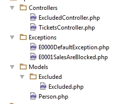

Phpdoc2rst
---

The tool for building of documentation of shared API in reStructuredText format.

For main API entities 



we can generate rst-files with data stored in PhpDoc annotations. 
Examples of results can be found [here](Resources/test/expected) .
 
The tool implemented as a bundle for Symfony 2 and provides 2 commands:

```shell
php app/console phpdoc2rst:process
```

The command generates rst-files for specified target (Controllers, Models of Exceptions)

**arguments:**

1. namespace - The namespace to process;
1. path - The path the namespace can be found in;

**options:**

- --output, -o - The path to output the ReST files;
- --title, -t - An alternate title for the top level namespace;
- --exclude, -x - Semicolon separated namespaces to ignore;
- --target - Which elements need to select. Default value 'properties'.
- --groups - Allows to fetch only properties of required group. 
    A string divided by commas. Default value ''.

```shell
php app/console phpdoc2rst:all
```

The command is a runner of several phpdoc2rst:process that specified in config.yml of the project

Example of config.yml section

```yml
patgod85_phpdoc2rst:
    errors_provider: my_bundle.errors
    tasks:
        email:
            subtasks:
                default:
                    target: 'properties'
                    namespace: 'MyBundle\Model'
                    input: '%kernel.root_dir%/../src/MyBundle/Model'
                    output: '%kernel.root_dir%/../src/MyBundle/Resources/views/model'
```
 
